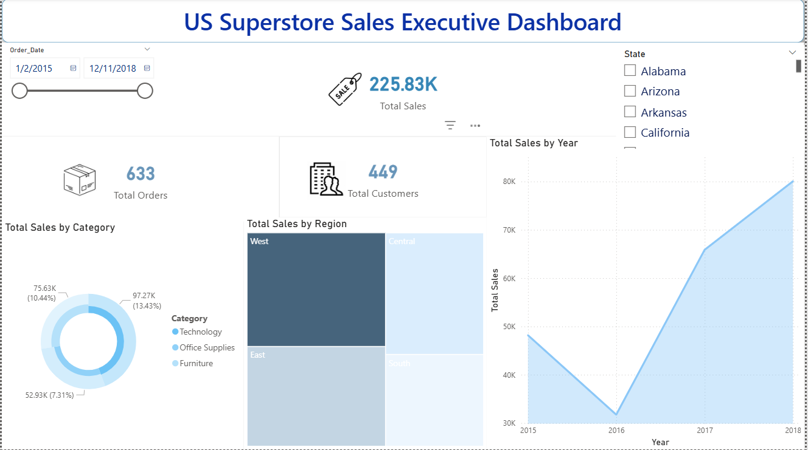

# 📊 US Superstore: End-to-End Data Analysis (SQL & Power BI)

## 💡 Impact Statement
> **Transforming raw transactional data into strategic business insights using SQL for processing and Power BI for interactive storytelling.**

---

## 🎨 Phase 1: Executive Dashboard (Power BI)
*The visual layer for real-time business monitoring.*

### **Dashboard Preview**


### **Key Visual Features:**
* **Interactive KPIs:** Real-time tracking of Total Sales ($225.83K), Orders (633), and Customers (449).
* **Regional Insights:** Treemap analysis identifying the West and East as major revenue engines.
* **Trend Intelligence:** Area charts visualizing growth patterns and seasonal fluctuations.
* **Dynamic Filtering:** Slicers for 'Order Date' and 'State' to allow deep-dive exploration.

---

## 💻 Phase 2: SQL Data Analysis & Deep-Dive Insights
*The core analysis where complex business questions were answered using T-SQL.*

### 1. Product Performance (Revenue Engines)
* **Top Performers:** 'Phones' and 'Chairs' were identified as the primary revenue drivers.


### 2. Yearly Revenue Trends
* Steady growth was observed from 2015 to 2018, with a significant spike in the final year.


### 3. Seasonal Peaks
* Significant sales activity detected in **February and August**, aligning with corporate buying cycles.
.png)

---

## 🚀 Strategic Recommendations
1. **Inventory Management:** Increase stock for "Phones" and "Chairs" during the Q3 peak.
2. **Regional Strategy:** Expand the furniture category in the West region to capitalize on high demand.
3. **Customer Retention:** Implement a loyalty program for identified high-value customers (Top Spenders).

---

## 🛠️ Tech Stack
* **Storage & Analysis:** SQL Server (T-SQL)
* **Visualization:** Power BI Desktop
* **Design Tools:** Power Query & DAX Modeling
  
# 🚀 Strategic Insights & Recommendations

After conducting a comprehensive analysis using **SQL**, **Power BI**, and **Python**, the following strategic insights were developed to drive business growth and operational efficiency:

---

### 1. Seasonal Tech–Education Synergy (Back-to-School)
* **Insight:** A significant increase in *Technology* and *Office Supplies* sales was observed during August and September, linked to the back-to-school period.
* **Recommendation:** Launch a targeted Back-to-School campaign focusing on high-margin Technology products (e.g., laptops, accessories) for students and educators. 
> **Note:** These months represent a key opportunity to maximize annual revenue.

---

### 2. Market Expansion & Logistics Optimization
* **Insight:** Certain states show strong market potential but suffer from lower Technology adoption or higher shipping costs, negatively impacting profitability.
* **Recommendation:** * **Warehousing:** Establish regional distribution centers in underperforming areas to reduce shipping costs and improve delivery times.
    * **Marketing:** Launch trust-building campaigns to increase technology adoption and reduce hesitation among new customers.

---

### 3. Maximizing Revenue through Bundling (Cross-Selling)
* **Insight:** *Office Supplies* have high purchase frequency but lower margins, while *Technology* products have higher margins but lower purchase frequency.
* **Recommendation:** Create strategic product bundles (e.g., **"Complete Home Office Bundle"**: PC + Desk + Stationery) to increase the **Average Order Value (AOV)** and boost overall revenue.

---

### 4. Customer Retention (The "Whale" Strategy)
* **Insight:** Analysis identified top customers (**"Whales"**) who contribute a significant portion of total revenue.
* **Recommendation:** Implement a premium loyalty program targeting these high-value customers to ensure long-term retention and minimize churn risk.

---
### 📊 Interactive Python Visualization
To complement the analysis, I developed a dynamic animation showing cumulative sales growth across categories. This visualization helps in understanding the sales momentum and seasonal peaks.


### 🐍 The Python Code
The following script was used to generate the animated visualization using **Pandas** and **Plotly Express**:

```python
import pandas as pd
import plotly.express as px

# Load and clean data
df = pd.read_csv('train.csv', encoding='latin1')
df['Order Date'] = pd.to_datetime(df['Order Date'], dayfirst=True)
df['Month_Year'] = df['Order Date'].dt.strftime('%Y-%m')

# Create monthly aggregated data
monthly_data = df.groupby(['Month_Year', 'Category'])['Sales'].sum().reset_index()

# Build cumulative frames for smooth animation
frames_list = []
unique_months = sorted(monthly_data['Month_Year'].unique())
for i, month in enumerate(unique_months):
    temp_df = monthly_data[monthly_data['Month_Year'] <= month].copy()
    temp_df['Frame'] = month
    frames_list.append(temp_df)
animated_df = pd.concat(frames_list)

# Plotting the Stacked Bar Chart
fig = px.bar(animated_df, x="Month_Year", y="Sales", color="Category",
             animation_frame="Frame", 
             color_discrete_sequence=['#003366', '#336699', '#99CCFF'],
             range_y=[0, monthly_data.groupby('Month_Year')['Sales'].sum().max() + 5000])

fig.update_xaxes(type='category', nticks=10)
fig.update_layout(barmode='stack', plot_bgcolor='white')
fig.show()

### 🛠️ Tech Stack Used:
* **SQL Server:** Data cleaning & complex queries.
* **Power BI:** Interactive dashboards & DAX measures.
* **Python (Plotly):** Animated data visualizations.
